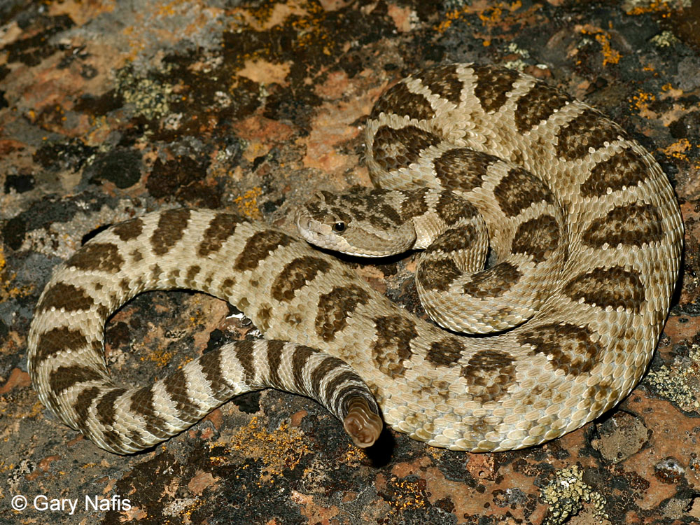

```{r setup, include=FALSE}
knitr::opts_chunk$set(echo = TRUE)
```


```{r message=FALSE, warning=FALSE, include=FALSE}
library(tidyverse)
library(leaflet)
library(geojson)
library(sf)
library(readxl)
library(leaflet.extras)
library(shiny)
```

```{r include=FALSE}
geojsonfile <- ("./TrainingAreasCW.geojson")
geojsondata <- sf::read_sf(geojsonfile)
st_crs(geojsondata)
geojsondata <- st_transform(geojsondata, 4326)
herpdat <- read_xlsx("./AllHerpData2019_2023_XY.xlsx")
herpdat <- herpdat %>% 
  rename(longitude = Long, latitude = Lat)

geojsondata <- st_transform(geojsondata, 4326)

herpdat_sf <- st_as_sf(herpdat, coords = c("longitude", "latitude"), crs = 4326)

coordinates <- data.frame(
  longitude = unlist(lapply(geojsondata$geometry, function(x) x[[1]][,-1])),
  latitude = unlist(lapply(geojsondata$geometry, function(x) x[[1]][,-2]))
)

merged_data <- st_join(geojsondata, herpdat_sf, join = st_intersects)

```

```{r, out.width = "600px",echo=FALSE}

```

```{r echo=FALSE}
species_counts <- merged_data %>%
  group_by(FEAT_NAME) %>%
  summarize(species = paste(unique(species), collapse = "<br>"))

polygon_species <- species_counts

popup_content <- function(feature) {
  if (!is.null(feature) && "FEAT_NAME" %in% names(feature) && "species" %in% names(feature)) {
    feat_species <- unlist(strsplit(feature$species, "<br>"))
    if (length(feat_species) > 0) {
      species_list <- paste(feat_species, collapse = "<br>")
      paste0("<b>FEAT_NAME:</b> ", feature$FEAT_NAME, "<br>",
             "<b>Species:</b><br>", species_list)
    } else {
      paste0("<b>FEAT_NAME:</b> ", feature$FEAT_NAME, "<br>",
             "<b>Species:</b><br>No species data available")
    }
  } else {
    "No feature data available"
  }
}

leaflet() %>%
  addTiles() %>%
  addPolygons(data = polygon_species, 
              fillColor = ~colorFactor("viridis", species)(species), 
              color = "black", 
              weight = 2, fillOpacity = 0.5,
              label = ~paste0("<b>FEAT_NAME:</b> ", FEAT_NAME, "<br>", "<b>Species:</b><br>", species), 
              popup = ~popup_content(.), 
              highlightOptions = highlightOptions(color = "white",
                                                  weight = 3,
                                                  bringToFront = TRUE))
```


Camp Williams is a U.S National Guard Army base located in Bluffdale UT. Since 2019 extensive herpetological wildlife surveys have been conducted by the Environmental Resource Management division with a primary focus on Great Basin Rattlesnake Research within the training areas. All observed herpetofauna are cataloged and recorded in all forms possible. To date there have been over 950 unique wildlife observations within the training range.


```{r echo=FALSE}
species_counts <- table(herpdat$species)

species_counts_df <- as.data.frame(species_counts)
colnames(species_counts_df) <- c("Species", "Total_Count")

species_counts_df <- species_counts_df[order(-species_counts_df$Total_Count),]

ggplot(species_counts_df, aes(x = reorder(Species, Total_Count), y = Total_Count)) +
  geom_bar(stat = "identity", fill = "skyblue") +
  labs(title = "Total Counts of Observed Species",
       x = "Species", y = "Total Count") +
  theme_minimal() +
  theme(axis.text.x = element_text(angle = 45, hjust = 1))
```

 The extremely high proportion of rattlesnake observations is due to den observations during the emergence and return parts of the season where large masses conglomerate in small areas. The high proportion of gopher snakes and yellow-bellied racers is due to the disproportionate aspect of road sampling as all reptiles observed on the road are recorded and the most frequently observed reptiles on the road are predominantly those two species.
 
```{r echo=FALSE}
leaflet() %>%
  addTiles() %>%
  addPolygons(data = geojsondata,
              fillColor = "transparent",
              color = "black",
              weight = 2,
              fillOpacity = 0.5,
              highlightOptions = highlightOptions(color = "white", weight = 3, bringToFront = TRUE)) %>%
  addCircleMarkers(data = herpdat_sf,
                   radius = 4,
                   color = "red",
                   fillColor = "red",
                   fillOpacity = 0.8,
                   popup = ~paste("Species: ", species),
                   label = ~species) %>%
  addLegend("bottomright", colors = "red", labels = "Species Observations")
```

The rattlesnake population of camp williams is highly abundant, concentrated heavily around multiple den sites across the training range.

```{r echo=FALSE}
# Read species observation data
herpdat <- read_xlsx("./AllHerpData2019_2023_XY.xlsx")

# Create a separate data frame for Great Basin Rattlesnake observations
great_basin_rattlesnake <- herpdat %>%
  filter(species == "Great Basin Rattlesnake")

# Check if any observations were found
if (nrow(great_basin_rattlesnake) == 0) {
  cat("No observations of Great Basin Rattlesnake found.")
} else {
  # Convert filtered data to sf object
  great_basin_rattlesnake_sf <- st_as_sf(great_basin_rattlesnake, coords = c("Long", "Lat"), crs = 4326)
  
  # Create leaflet map
  leaflet() %>%
    addTiles() %>%
    addCircleMarkers(data = great_basin_rattlesnake_sf,
                     radius = 4,
                     color = "red",
                     fillColor = "red",
                     fillOpacity = 0.8,
                     popup = ~paste("Species: Great Basin Rattlesnake"),
                     label = ~"Great Basin Rattlesnake")
}
```

Uniquely, there was also a single observation of a Great Basin Spadefoot Toad found in an area highly frequented by environmental employees after a particularly rainy season. This individual of this species may have lain dormant for an multiple years prior to this emergence.

```{r, out.width = "600px",echo=FALSE}

```

```{r echo=FALSE}
# Read species observation data
herpdat <- read_xlsx("./AllHerpData2019_2023_XY.xlsx")

# Create a separate data frame for Great Basin Spadefoot observations
great_basin_spadefoot <- herpdat %>%
  filter(species == "Greast Basin Spadefoot")

# Check if any observations were found
if (nrow(great_basin_spadefoot) == 0) {
  cat("No observations of Great Basin Spadefoot found.")
} else {
  # Convert filtered data to sf object
  great_basin_spadefoot_sf <- st_as_sf(great_basin_spadefoot, coords = c("Long", "Lat"), crs = 4326)
  
  # Create leaflet map
  leaflet() %>%
    addTiles() %>%
    addCircleMarkers(data = great_basin_spadefoot_sf,
                     radius = 4,
                     color = "blue",
                     fillColor = "blue",
                     fillOpacity = 0.8,
                     popup = ~paste("Species: Great Basin Spadefoot"),
                     label = ~"Great Basin Spadefoot") %>% 
    setView(lng = -112.084368, lat = 40.434463, zoom = 13)
}
```
Additionally, the presence of an invasive species of lizard, the New Mexico Whiptail lizard has been confirmed and appears to be spreading its range, radiating from the Jordan River area.

```{r, out.width = "600px",echo=FALSE}

```

```{r echo=FALSE}
# Read species observation data
herpdat <- read_xlsx("./AllHerpData2019_2023_XY.xlsx")

# Create a separate data frame for New Mexico Whiptail observations
new_mexico_whiptail <- herpdat %>%
  filter(species == "New Mexico Whiptail")

# Check if any observations were found
if (nrow(new_mexico_whiptail) == 0) {
  cat("No observations of New Mexico Whiptail found.")
} else {
  # Convert filtered data to sf object
  new_mexico_whiptail_sf <- st_as_sf(new_mexico_whiptail, coords = c("Long", "Lat"), crs = 4326)
  
  # Create leaflet map
  leaflet() %>%
    addTiles() %>%
    addCircleMarkers(data = new_mexico_whiptail_sf,
                     radius = 4,
                     color = "green",
                     fillColor = "green",
                     fillOpacity = 0.8,
                     popup = ~paste("Species: New Mexico Whiptail"),
                     label = ~"New Mexico Whiptail")
}
```
