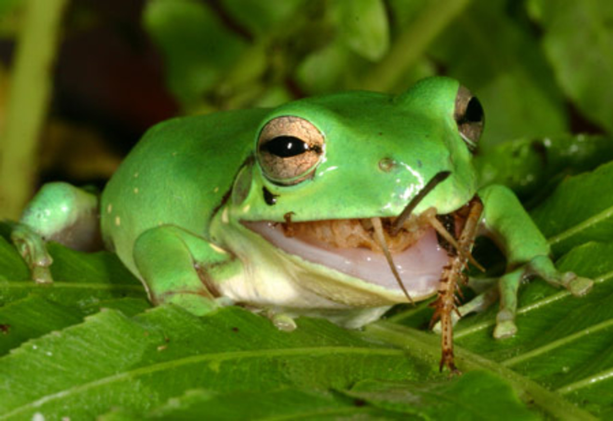

```{r setup, include=FALSE}
knitr::opts_chunk$set(echo = TRUE)
```


```{r, out.width = "600px",echo=FALSE}

knitr::include_graphics("./")
```

## [More Frogs](http://Tug-Simmons.github.io/Frogs) | [Resume](http://Tug-Simmons.github.io/Resume/Resume.pdf) | [Camp Williams](http://Tug-Simmons.github.io/Camp_Williams)


